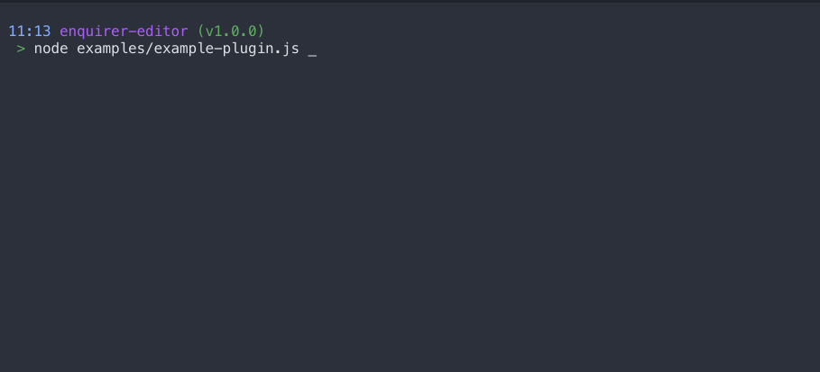

# Enquirer Editor

> A prompt built with [enquirer](https://www.npmjs.com/package/enquirer) that spawns a temporary editor using the preferred editor (`$VISUAL` or `$EDITOR`); it will default to Vim or Notepad. The contents of the editor will be returned once the user saves the file. The content can be validated or altered upon being submitted.

&nbsp;

## **Install**

```
npm i enquirer-editor-prompt
```

&nbsp;

## **Demonstration**



&nbsp;

## **Usage**

There are two ways to use `enquirer-editor` — as a standalone prompt or as a plugin for enquirer (which allows the usage of other prompts).

&nbsp;

### **Standalone Prompt**
```javascript
// Import the prompt
const EditorPrompt = require('enquirer-editor');

// Create a new instance of the prompt (name not required)
const prompt = new EditorPrompt({
  type: 'editor',
  message: 'Please write a short bio of at least 3 lines',
  initial: 'Start writing!',
  validate: function (response) {
    if (response.split('\n').length < 4) {
      return 'The bio must be at least 3 lines.';
    }
    return true;
  },
});

// Run the prompt
prompt.run()
    .then(console.log)
    .catch(console.error);
```
&nbsp;

### **Plugin Prompt**
```javascript
// Import enquirer and the editor prompt
const Enquirer = require('enquirer');
const EditorPrompt = require('enquirer-editor');

// Create a new instance of enquirer and register the prompt
const enquirer = new Enquirer();
enquirer.register('editor', EditorPrompt);

// Create your questions (name required)
const questions = [
  {
    type: 'editor',
    name: 'bio',
    message: 'Please write a short bio of at least 3 lines',
    initial: 'Start writing!',
    validate: function (response) {
      if (response.split('\n').length < 4) {
        return 'The bio must be at least 3 lines.';
      }
      return true;
    },
  },
];

// Run prompt with your questions
enquirer.prompt(questions)
    .then(console.log)
    .catch(console.error);
```

&nbsp;

### **Prompt Options**

| option | description | type | default |
| :--- | :--- | :--- | :--- |
| type | The prompt type (`editor`) | string | |
| name | The property name for the prompt's output | string | |
| message | The message that will be displayed during the prompt | string | this.type |
| initial | The initial value for the editor | string | '' |
| validate | A function to validate the submitted output | function | |
| result | A function to alter the submitted output | function | |

&nbsp;

## **Credit**

This prompt was designed based off of [inquirer](https://www.npmjs.com/package/inquirer)'s editor prompt and uses the same editor as the [prompt-editor](https://www.npmjs.com/package/prompt-editor) package. It works with the latest version of [enquirer](https://www.npmjs.com/package/enquirer) (v2.3.2).

&nbsp;

I wrote this for my own personal use but I'm open to feature requests. Feel free to report an [issue](https://github.com/ginsm/enquirer-editor/issues) or request a feature! Thank you for reading. 😄